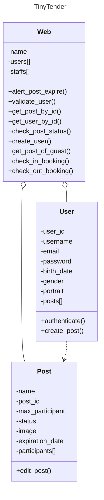

```mermaid
---
title: TinyTender
---
classDiagram

    Web o-- Post
    Web o-- User
    User ..> Post

    class Web{
        -name
        -users[]
        -staffs[]
        +alert_post_expire()
        +validate_user()
        +get_post_by_id()
        +get_user_by_id()
        +check_post_status()
        +create_user()
        +get_post_of_guest()
        +check_in_booking()
        +check_out_booking()
    }

    class User{
        -user_id
        -username
        -email
        -password
        -birth_date
        -gender
        -portrait
        -posts[]
        +authenticate()
        +create_post()
    }

    class Post{
        -name
        -post_id
        -max_participant
        -status
        -image
        -expiration_date
        -participants[]
        +edit_post()
    }

```
